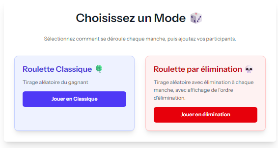
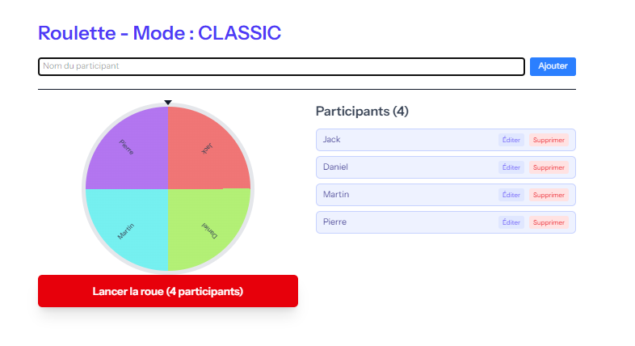
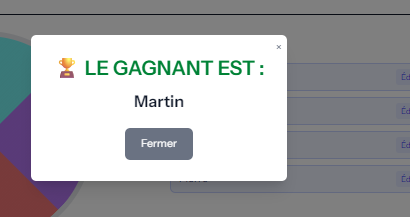
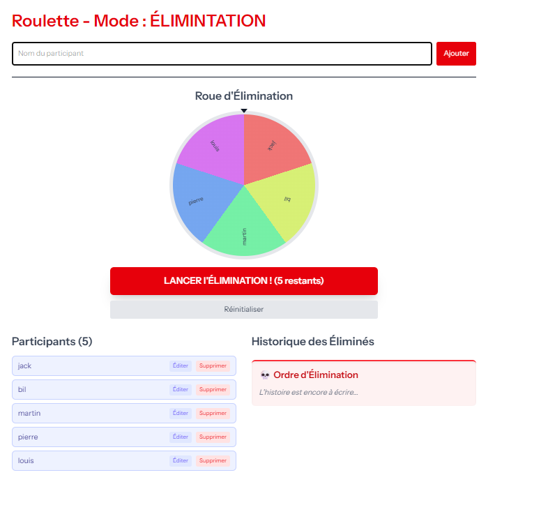
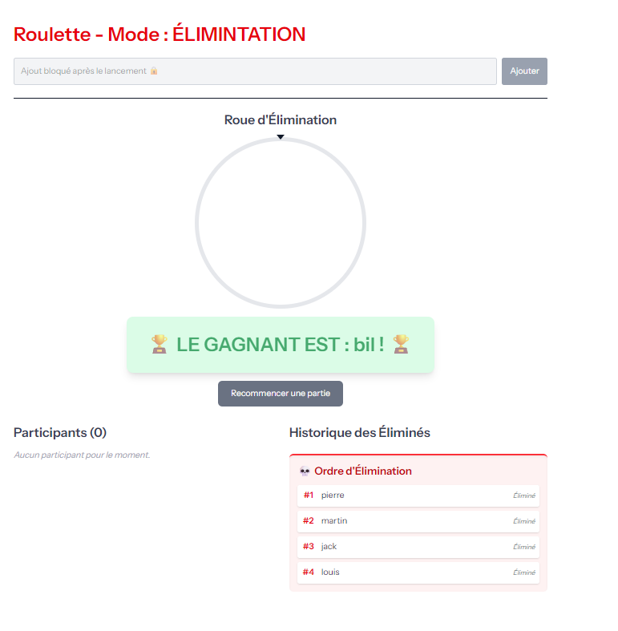

# NexaSpinV1 🎡

> Application Web de Roulette Interactive pour Tirages au Sort


---

## 📌 À propos du projet

**NexaSpinV1** est une application web moderne permettant d'organiser des tirages au sort à travers deux systèmes de roulette distincts.

Développée avec **Laravel 12**, **Livewire 3** et **Tailwind CSS 4**, elle offre une expérience utilisateur fluide, réactive et sans rechargement de page.

> ⚡ Fonctionne sans base de données : les participants et les résultats sont stockés en session. Aucune configuration SQL n'est nécessaire.

---

## 📸 Aperçu de l'application

### 🏠 Sélection du mode



### 🍀 Roulette Classique



### 🏆 Résultat Roulette Classique



### 💀 Roulette par Élimination



### 🏆 Résultat Roulette Élimination



---

## 🎯 Cas d'utilisation

- Concours et tombolas
- Tirages au sort en présentiel ou en ligne
- Sélection aléatoire de participants
- Constitution d'équipes
- Jeux événementiels
- Processus d'élimination
- Utilisation pédagogique en classe

---

## ✨ Fonctionnalités

### 🎯 Deux Modes de Roulette

| Mode | Description | Particularités |
|--------|--------|--------|
| 🍀 Roulette Classique | Tirage aléatoire d'un gagnant unique | Résultat immédiat |
| 💀 Roulette par Élimination | Élimination progressive des participants | Historique complet jusqu'au gagnant |

### 🎛 Fonctionnalités communes

- ✅ Ajout de participants
- ✅ Modification de participants
- ✅ Suppression de participants
- ✅ Validation des données
- ✅ Animation de la roue
- ✅ Notifications utilisateur
- ✅ Historique des éliminations
- ✅ Réinitialisation instantanée
- ✅ Interface responsive
- ✅ Compatible mobile, tablette et desktop

---

## 🚀 Installation

### Prérequis

- PHP ≥ 8.2
- Composer ≥ 2.5
- Node.js ≥ 18
- Apache ou Nginx

> ⚠️ Aucune base de données requise.

### Installation

```bash
git clone https://github.com/DocCreeps/NexaSpinV1.git

cd NexaSpinV1

composer install

npm install

cp .env.example .env

php artisan key:generate

npm run dev

php artisan serve
```

Application disponible sur :

```text
http://localhost:8000
```

Pour la production :

```bash
npm run build
```

---

## 🎮 Utilisation

### 1. Choisir un mode

- Roulette Classique
- Roulette par Élimination

### 2. Ajouter les participants

- Saisir un nom
- Cliquer sur Ajouter
- Modifier ou supprimer si nécessaire

Minimum requis : **2 participants**

### 3. Lancer la roulette

- Cliquer sur **Lancer la roulette**
- Attendre la fin de l'animation
- Consulter le résultat

### 4. Mode Élimination

- Un participant est éliminé à chaque manche
- L'ordre d'élimination est conservé
- Le dernier participant restant est déclaré gagnant

### 5. Réinitialiser

Le bouton **Réinitialiser** restaure l'état initial de la roulette.

---

## 🧪 Tests

Le projet utilise **Pest PHP** pour les tests automatisés.

### Exécuter tous les tests

```bash
php artisan test
```

ou

```bash
./vendor/bin/pest
```

### Exécuter un test spécifique

```bash
php artisan test --filter="nom_du_test"
```

### Couverture actuelle

Les tests couvrent notamment :

- Gestion des participants
- Validation des entrées
- Logique métier des stratégies de roulette
- Comportement des composants Livewire
- Gestion des états de jeu

---

## 💡 Choix Techniques

### Pourquoi Livewire ?

- Réactivité sans framework JavaScript complexe
- Intégration native avec Laravel
- Maintenance simplifiée

### Pourquoi les Sessions ?

- Aucune base de données nécessaire
- Déploiement simplifié
- Rapidité de mise en œuvre

### Pourquoi le Strategy Pattern ?

- Séparation claire de la logique métier
- Extensible pour de futurs modes de tirage
- Respect du principe Open/Closed

---

## 🏗 Architecture Technique

### Stack Technique

| Composant | Technologie |
|------------|------------|
| Backend | Laravel 12 |
| Composants Réactifs | Livewire 3 |
| Frontend | Blade |
| CSS | Tailwind CSS 4 |
| Bundler | Vite 7 |
| Tests | Pest PHP |
| Langage | PHP 8.2+ |

### Design Patterns

- Strategy Pattern
- Trait Composition
- Event-Driven Architecture
- MVC

### Organisation du projet

```text
app/
├── Livewire/
├── Services/
│   └── Roulette/
├── Models/
└── Providers/

resources/
├── views/
└── css/

routes/
└── web.php

tests/
├── Feature/
└── Unit/
```

---

## 📊 Routes

| Méthode | URL | Description |
|----------|----------|----------|
| GET | / | Sélection du mode |
| GET | /roulette/classic | Roulette classique |
| GET | /roulette/elimination | Roulette par élimination |

---

## 📚 Ressources

- Laravel Documentation
- Livewire Documentation
- Tailwind CSS Documentation
- Vite Documentation
- Pest PHP Documentation

---


## 👨‍💻 Auteur

Développé avec ❤️ par **DocCreeps**

GitHub : https://github.com/DocCreeps

---

**NexaSpinV1** — Une application moderne de tirage au sort construite avec Laravel, Livewire et Tailwind CSS.
